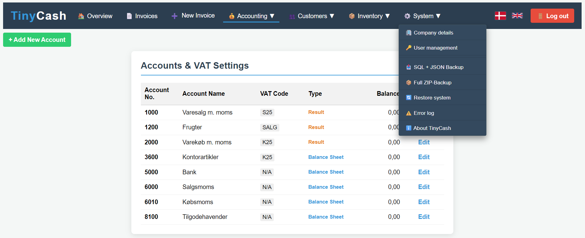

# TinyCash 🛠️

TinyCash is a lightweight, web-based accounting and inventory management system built with PHP and MySQL. It is designed for small businesses that need a simple, fast, and efficient solution for invoicing and stock tracking.

## Key Features & Qualities

* 🌍 **Built-in Language Switching:** Seamlessly switch between languages. The system is designed for easy localization, allowing you to adapt the interface to your preferred region.
* 📦 **Automated Inventory Control:** Stop manual tracking. Stock levels are automatically updated whenever an invoice is created, ensuring your product counts are always accurate.
* 🔐 **Privacy-First (Self-Hosted):** You own your data. No third-party cloud dependencies or monthly subscriptions. Run everything securely on your own infrastructure.
* ⚡ **Lightweight & Fast:** Built with clean PHP/MySQL logic, ensuring high performance even on basic shared hosting environments.
* 🛠️ **Developer Friendly:** A modular, transparent codebase that is easy to audit, extend, and customize for specific business needs.

---

## Features

* **Customer Management:** Create, update, and manage your client database efficiently.
* **Inventory Tracking:** Real-time stock management with automatic deductions during invoicing.
* **Invoicing:** Generate professional, clean invoices with built-in print-ready layouts.
* **Collector Tool:** A built-in utility located in `/tools/` for quick code backups, project snapshots, and easy deployment.

👉 **Try and feel:** [Live Demo](https://ev-soft.dk/TinyCashControl/tiny_cash/index.php)

---

## Installation & Configuration

### 1. Source Files
Upload all files and folders from the repository to your PHP-enabled web server (e.g., via FTP).

### 2. Database Setup

1. Create a fresh MySQL database through your hosting control panel.
2. Import the provided `database_blueprint.sql` to set up the required tables (`users`, `inventory`, etc.).
3. Navigate to the `/inc/` directory.
4. Open `db_connect.dat.php` (or look at `db_connect.doc.php` for reference) and update it with your actual database credentials:
   ```php
   $db_host = "localhost";
   $db_user = "your_database_user";
   $db_pass = "your_database_password";
   $db_name = "your_database_name";

### 3. Language:
   - The system defaults to English but can be switched via the built-in language selector.
   - More than 10 languages ​​are prepared and there are tools to maintain language databases
  
